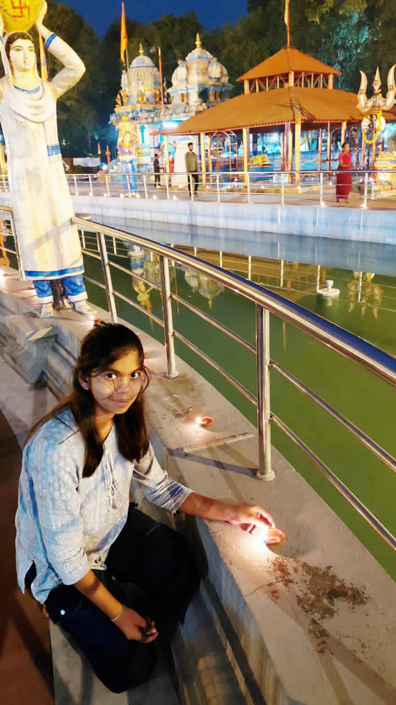

# for-shri
<!DOCTYPE html>
<html>
<head>
<title>For Shri 🤍</title>

</head>

<body>

<!-- LOGIN -->

<h2>Only for Shri 🤍</h2>
<input type="password" id="pass" placeholder="Enter Secret Code">
 
<button onclick="unlock()">Unlock</button>

<!-- QUESTION PAGE -->

<h2>Shri 💖</h2>

Kya Aaditya tumko pasand hai? 😌

<button onclick="nextPage()">Haan 💕</button>
<button onclick="nextPage()">Bilkul Haan 💖</button>

<!-- FINAL PAGE -->

<h2>Shri 👑</h2>

Tu meri duniya hai.  
Tu meri Malkin hai.  
Aur Aaditya sirf tera hai 💗

</body>
</html>
